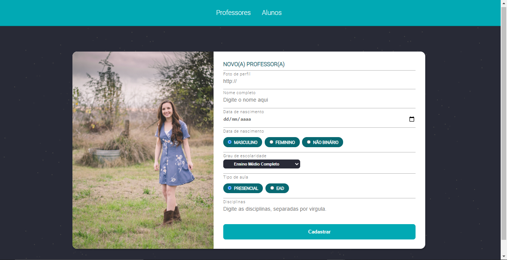

<h3 align="center">
  My Class
</h3>
<p align="center">

  <a href="LICENSE" >
    
  </a>

</p>

# My Class


# :bookmark_tabs: Index

  - [:clipboard: About](#clipboard-about)
    - [:white_check_mark: Features](#white_check_mark-features)
  - [:computer: Technologies](#computer-technologies)
  - [:computer: Dependencies](#computer-dependencies)
  - [Requirements](#requirements)
  - [:file_folder: How to install](#file_folder-how-to-install-and-use)
  - [:alien: Author](#alie-author)

---

## :clipboard: About
This website application has one goal - allow web schools
to manage their users and teachers, and have a better overview of all registered users.

Users can edit their own information. It's based on the project Gym manager developed during the classes from Rocketseat.
This project and readme.md, will be updated according to the project evolution.

---

### :white_check_mark: Features
* Teachers

- [x] Create teacher
- [x] Edit teacher
- [x] Show teacher
- [x] Delete teacher

* Students

- [x] Create students
- [x] Edit students
- [x] Show students
- [x] Delete students

---
## :computer: Technologies
* [HTML5](https://developer.mozilla.org/en-US/docs/Web/HTML)
* [CSS3](https://developer.mozilla.org/en-US/docs/Web/CSS)
* [JavaScript](https://www.javascript.com/)
* [NodeJs](https://www.nodejs.org/)

---
## :computer: Dependencies
* [Express](https://expressjs.com/pt-br/)
* [Nunjucks](https://mozilla.github.io/nunjucks/)
* [Nodemon](https://nodemon.io/)
* [Browser Sync](https://browsersync.io/)

---

## Requirements
To execute this project, you need [Git](https://git-scm.com/) and [NodeJs](https://nodejs.org/en/) installed in your device.
It's recommended to use a code editor like [VsCode](https://code.visualstudio.com/).

---

## :file_folder: How to install and use
* First clone the repository with the command below.
```bash
    # Using Git bash, clone the repository
    $ git clone https://github.com/Guilherme-A-Santos/my-class.git
```

* After this, enter in the project main folder.

```bash
    # Changing directory in the terminal/CMD
    $ cd my-class
```
* Then install all dependencies using the command `npm install`.

```bash
    # Installing all dependencies
    $ npm install
```

* In a terminal, use the command `npm start` to allow the project to run.

```bash
    # Starting the project
    $ npm start
```

* Then open your browser (Google Chrome is the most recommended) and type in url *localhost:5000*

```bash
    # The project will run in the port:3000 if you're using browser-sync

    # You can acess too using the port:5300
```

## :alien: Author
---

 
 <br />
 <sub><b>Guilherme A. Santos</b></sub>


Made with ❤️ by Guilherme A. Santos

